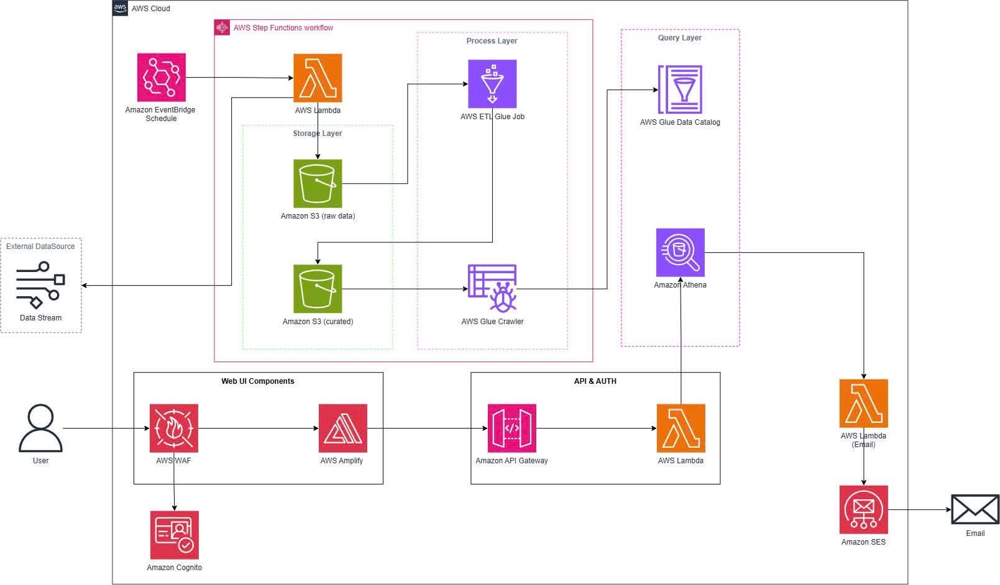

# Vietnam Financial Distress Prediction System

<div align="center">
  
  
  
  
  
  
  
</div>

<br/>



Nền tảng **AWS Cloud & Serverless** tự động hóa thu thập, phân tích và dự đoán nguy cơ kiệt quệ tài chính doanh nghiệp.

---

## 1. Tóm tắt điều hành
Vietnam Financial Distress Prediction System được thiết kế nhằm xây dựng một giải pháp toàn diện trên nền tảng AWS Cloud, giúp tự động thu thập, chuẩn hóa dữ liệu báo cáo tài chính (BCTC) và giá thị trường của các doanh nghiệp niêm yết trên 3 sàn chứng khoán Việt Nam (HOSE, HNX, UPCOM). 

Hệ thống ứng dụng kiến trúc AWS Serverless kết hợp các mô hình Machine Learning (Logistic Regression, Random Forest, XGBoost, LightGBM, CatBoost) để tính toán bộ chỉ số tài chính (Liquidity, Profitability, Leverage, Size & Growth), tự động gán nhãn rủi ro (Rule-based & Altman Z-Score Emerging Market), và phát hiện sớm nguy cơ kiệt quệ tài chính (Financial Distress) / phá sản. Nền tảng tích hợp Web Dashboard (AWS Amplify, React), bảo mật với Amazon Cognito, phân quyền API qua API Gateway và gửi cảnh báo tự động qua Amazon SES cho các nhà đầu tư, chuyên viên phân tích tài chính và quản trị rủi ro.

---

## 2. Tuyên bố vấn đề

### Vấn đề hiện tại
Hiện nay, dữ liệu tài chính tại Việt Nam rải rác trên nhiều nguồn (vnstock, TCBS, CafeF, Vietstock, VCI, MAS, KBS) với định dạng không nhất quán (Long-form vs Wide-form), nhiều chỉ tiêu bị phân mảnh hoặc thiếu hụt. Việc thu thập và phân tích BCTC thủ công tiêu tốn rất nhiều thời gian, dễ phát sinh sai sót và không thể theo dõi liên tục hàng nghìn doanh nghiệp. Bên cạnh đó, các công cụ phân tích hiện tại thiếu khả năng gán nhãn tự động theo quy định và mô hình cảnh báo sớm kiệt quệ tài chính chuyên biệt cho thị trường chứng khoán Việt Nam.

### Giải pháp
Nền tảng tận dụng **Amazon EventBridge** và **AWS Step Functions** để điều phối các tiến trình cào dữ liệu tự động từ các nguồn API/web qua **AWS Lambda / ECS Task**, lưu trữ dữ liệu thô vào **Amazon S3 (raw)**. Tiến trình ETL bằng **AWS Glue Job** thực hiện chuẩn hóa chỉ tiêu, xử lý dữ liệu khuyết thiếu (missing data) và Winsorization, sau đó lưu dữ liệu đã làm sạch dưới dạng Parquet vào **Amazon S3 (curated)**. **AWS Glue Crawler** và **Glue Data Catalog** tự động cập nhật metadata, cho phép **Amazon Athena** truy vấn SQL tức thì. Bộ engine tính toán chỉ số và gán nhãn tích hợp cả chuẩn Rule-based thực tế tại Việt Nam (lỗ lũy kế 2 năm, VCSH âm, EBIT không đủ trả lãi vay, OCF âm 3 năm) và chỉ số Altman Z-Score. Ứng dụng web fullstack hosted trên **AWS Amplify** với **Amazon Cognito** quản lý xác thực và **Amazon SES** tự động gửi email cảnh báo khi Z-Score rơi vào vùng nguy hiểm (Distress Zone).

### Lợi ích và hoàn vốn đầu tư (ROI)
- **Tự động hóa 100% luồng dữ liệu:** Đóng gói toàn bộ quy trình từ cào dữ liệu, làm sạch, lưu trữ Data Lake đến gán nhãn và dự đoán ML.
- **Cảnh báo sớm & Chính xác:** Giúp nhà đầu tư và tổ chức tài chính phát hiện rủi ro kiệt quệ tài chính trước 1–2 năm với chỉ số Recall cao.
- **Tối ưu chi phí vận hành (Serverless):** Chi phí cơ sở hạ tầng cực kỳ tiết kiệm nhờ mô hình pay-as-you-go của AWS Serverless, ước tính khoảng 1,50 – 3,00 USD/tháng cho quy mô vận hành chuẩn.
- **Khả năng mở rộng vượt trội:** Sẵn sàng xử lý dữ liệu cho hơn 1.600+ doanh nghiệp niêm yết trên cả 3 sàn HOSE, HNX, UPCOM.

---

## 3. Kiến trúc giải pháp

Hệ thống áp dụng kiến trúc Serverless 5 phân vùng chuyên biệt trên AWS Cloud:

### Dịch vụ AWS sử dụng
- **Amazon EventBridge:** Kích hoạt cron schedule định kỳ cho luồng thu thập dữ liệu BCTC quý/năm.
- **AWS Step Functions:** Điều phối workflow thu thập dữ liệu đa luồng, retry và quản lý checkpointing.
- **AWS Lambda / ECS:** Gọi API/Crawl dữ liệu tài chính từ vnstock, TCBS, CafeF, Vietstock và xử lý backend REST API.
- **Amazon S3:** Lưu trữ Data Lake gồm 2 bucket (S3 raw data cho JSON/CSV và S3 curated data cho Parquet).
- **AWS Glue:** Glue Jobs (Python/Spark ETL) làm sạch và biến đổi dữ liệu; Glue Crawlers quét schema; Glue Data Catalog lưu trữ metadata.
- **Amazon Athena:** Truy vấn SQL Serverless trực tiếp trên S3 curated data với tốc độ cao.
- **AWS Amplify:** Hosting giao diện Web Dashboard (React).
- **Amazon Cognito:** Quản lý đăng nhập, phân quyền (Admin / Guest / Analyst) và cấp JWT token.
- **Amazon API Gateway:** RESTful API Gateway bảo mật tiếp nhận request từ Web Frontend.
- **AWS WAF:** Tường lửa bảo vệ API Gateway và Amplify khỏi tấn công mạng (DDoS, SQL Injection).
- **Amazon SES:** Tự động gửi email cảnh báo rủi ro kiệt quệ tài chính cho người dùng.

### Thiết kế thành phần
- **Ingestion Layer:** EventBridge kích hoạt Step Functions gọi Lambda/ECS Task thu thập dữ liệu 3 BCTC (Bảng cân đối kế toán, Kết quả kinh doanh, Lưu chuyển tiền tệ) và giá cổ phiếu, loại bỏ hoàn toàn ngành tài chính (Ngân hàng, Chứng khoán, Bảo hiểm, Quỹ đầu tư).
- **Storage Layer:** S3 Raw lưu trữ dữ liệu gốc dạng JSON/CSV; S3 Curated lưu trữ dữ liệu đã chuẩn hóa, làm sạch và gán nhãn dạng Parquet phân theo năm/quý.
- **Processing & ETL Layer:** AWS Glue Job chuẩn hóa tên chỉ tiêu, lọc doanh nghiệp đủ 5 năm dữ liệu, xử lý outlier (Winsorize 1%-99%), tính bộ chỉ số tài chính (CR, WCTA, ROA, ROE, EBIT_REV, DAR, STDR, LTDR, LogAsset, MC_Debt) và gán nhãn distress.
- **Query & ML Layer:** Glue Crawler trích xuất schema vào Data Catalog; Athena phục vụ truy vấn ad-hoc và backend API. (Định hướng tương lai: Tích hợp mô hình Machine Learning như XGBoost, Random Forest để huấn luyện và dự đoán rủi ro chuyên sâu).
- **User Interface & Alerting:** Amplify giao diện Dashboard trực quan; API Gateway + Lambda Backend xử lý yêu cầu; Cognito đảm bảo an toàn truy cập; SES phát thông báo cảnh báo tức thì.

---

## 4. Cấu trúc thư mục (Directory Structure)

Dự án được tổ chức theo tiêu chuẩn Monorepo, phân tách rõ ràng giữa hạ tầng, luồng xử lý dữ liệu và ứng dụng giao diện (Local to AWS):

```text
Main_project/
├── .github/workflows/       # (CI/CD) Tự động hóa kiểm thử và triển khai hạ tầng lên AWS.
├── react-frontend/          # (Frontend) Source code Web Dashboard viết bằng React (Vite/Tailwind). Triển khai trên AWS Amplify.
├── src/
│   ├── api/                 # (Backend) FastAPI xử lý requests, kết nối Athena. Triển khai dưới dạng Lambda function qua API Gateway.
│   ├── pipeline/            # (Data Pipeline) Code xử lý ETL, tính toán chỉ số, mô hình ML nội bộ (Local/Glue).
│   ├── lambda_collector/    # (AWS Lambda) Các hàm thu thập dữ liệu thô (Ingestion).
│   ├── lambda_processor/    # (AWS Lambda) Các hàm xử lý ETL sự kiện nhỏ lẻ.
│   ├── lambda_reader/       # (AWS Lambda) Các hàm đọc dữ liệu/truy vấn.
│   └── lambda_worker/       # (AWS Lambda) Các tiến trình tính toán nền (Background workers).
├── terraform/               # (IaC) Mã nguồn Infrastructure as Code thiết lập toàn bộ tài nguyên trên AWS.
├── tests/                   # (Testing) Unit tests, integration tests, E2E tests đảm bảo chất lượng hệ thống (chạy qua CI).
├── reports/                 # (Analytics) Thư mục chứa các kết quả báo cáo local (CSV/JSON), smoke tests dữ liệu.
├── images/                  # (Assets) Chứa các tài nguyên tĩnh như sơ đồ kiến trúc (Architecture.jpg).
└── uv.lock & settings.py    # (Config) Cấu hình môi trường Python và thư viện phụ thuộc.
```

---

## 5. Triển khai kỹ thuật

### Yêu cầu kỹ thuật
- **Data Engine:** Python 3.11+, vnstock, pandas, pyarrow, numpy, scikit-learn, xgboost, lightgbm, catboost.
- **AWS Services & Infrastructure:** Terraform / AWS CDK để quản lý Infrastructure as Code (IaC).
- **Backend & Web App:** FastAPI cho REST API, React cho Frontend, Zustand cho Client State Management, Tailwind CSS cho giao diện.
- **Bảo mật & Chuẩn hóa:** SSL/TLS, WAF, OAuth2 / JWT với Amazon Cognito, tuân thủ nguyên tắc Least Privilege trên IAM Roles.

---

## 6. Ước tính ngân sách (AWS Pricing)
Mô hình Serverless mang lại lợi thế tối ưu chi phí (Pay-as-you-go). Ước tính cho quy mô tiêu chuẩn:

- **Amazon S3 Standard** (Raw & Curated 10 GB, 5.000 requests): 0,30 USD/tháng
- **AWS Lambda** (Inbound Ingestion & Backend API 50.000 requests): 0,20 USD/tháng
- **AWS Step Functions & EventBridge:** 0,10 USD/tháng
- **AWS Glue ETL Jobs & Crawlers** (chạy theo lịch tháng/quý): 0,80 USD/tháng
- **Amazon Athena** (Quét < 10 GB Parquet/tháng): 0,05 USD/tháng
- **AWS Amplify & Amazon Cognito** (Guest & User access): 0,35 USD/tháng
- **Amazon API Gateway & AWS WAF:** 0,15 USD/tháng
- **Amazon SES** (Email Alerts < 1.000 emails/tháng): 0,05 USD/tháng

**Tổng cộng:** ~2,00 USD/tháng (~24,00 USD/năm).
> Chi phí dữ liệu & phát triển: 0 USD (tận dụng nguồn dữ liệu mở vnstock và công cụ mã nguồn mở).

---

## 7. Đánh giá rủi ro

### Ma trận rủi ro
- Thay đổi cấu trúc API/Website nguồn (vnstock/CafeF/TCBS): Ảnh hưởng cao, xác suất trung bình.
- Dữ liệu BCTC khuyết thiếu hoặc bị sai lệch từ nguồn: Ảnh hưởng trung bình, xác suất cao.
- Lệch nhãn rủi ro (Imbalanced Dataset giữa doanh nghiệp lành mạnh và kiệt quệ): Ảnh hưởng cao, xác suất cao.
- Vượt ngân sách AWS do truy vấn Athena/Glue chạy không kiểm soát: Ảnh hưởng trung bình, xác suất thấp.

### Chiến lược giảm thiểu
- **Nguồn dữ liệu:** Thiết lập cơ chế đa nguồn (VCI, MAS, KBS) và fallback parser tự động trong Ingestion Layer.
- **Dữ liệu khuyết thiếu:** Áp dụng bộ lọc bắt buộc 5 năm liên tục, loại bỏ ngành tài chính và dùng kỹ thuật Winsorize xử lý nhiễu.
- **Imbalanced Dataset:** Áp dụng kỹ thuật SMOTE / Class Weighting và tập trung tối ưu metric Recall đối với lớp Distress (Class 1).
- **Chi phí AWS:** Thiết lập AWS Budget Alerts, tối ưu lưu trữ Parquet có Partitioning để Athena quét tối thiểu số bytes.

### Kế hoạch dự phòng
- Lưu trữ bản sao Local/Parquet trên S3 để khôi phục nhanh nếu tiến trình ETL gặp sự cố.
- Sử dụng cấu hình Terraform để tái khởi tạo toàn bộ hạ tầng Serverless trong thời gian ngắn.

---

## 8. Kết quả kỳ vọng
1. **Cải tiến kỹ thuật:** Xây dựng hệ thống Data Lake tự động hóa 100% trên AWS, thay thế hoàn toàn quy trình phân tích BCTC thủ công. 
2. **Giá trị dài hạn:** Cung cấp nền tảng dữ liệu tài chính Việt Nam chuẩn hóa, sẵn sàng mở rộng cho các bài toán định giá, chấm điểm tín dụng (Credit Scoring) hoặc phân tích định lượng (Quantitative Trading).

---

## 9. Định hướng tương lai (Future Work)
- **Phát triển Engine Chỉ số, Gán nhãn & ML Pipeline:** Đang trong quá trình nghiên cứu và cố gắng triển khai trong tương lai. Trọng tâm là hoàn thiện Ratio Engine, Distress Labeling Engine, tiến hành huấn luyện và đánh giá các mô hình ML (XGBoost, Random Forest) để đưa ra cảnh báo sớm nguy cơ kiệt quệ tài chính chuyên sâu dựa trên chỉ số Recall & AUC-ROC.
